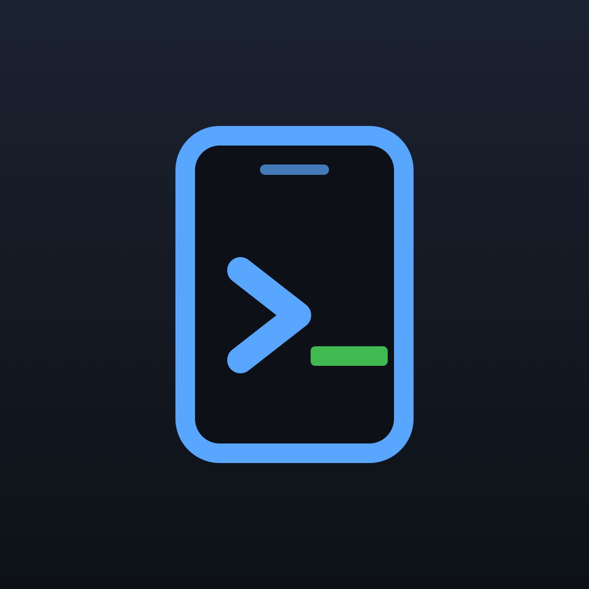

# pockterm

<p align="center"></p>

Your computer's terminal, on your phone. LAN-only, paired by QR, encrypted with a
pinned self-signed certificate.

## Features

- **Real shell, on your phone** — a full PTY (your `$SHELL` on macOS/Linux,
  PowerShell on Windows), streamed live over WebSocket.
- **Multi-session tabs** — spawn, switch, and kill named sessions from the app.
- **Reconnect-safe** — sessions live in the server with a scrollback buffer, so
  backgrounding the app or a Wi-Fi blip resumes right where you left off (replayed
  on attach; auto-reconnect with backoff).
- **QR pairing, no accounts** — scan once; the app stores a session token and
  reconnects automatically. Restart the server to revoke every paired phone.
- **Auto re-pair on expiry** — when the token rotates, the app drops to the scan
  screen with a "session expired" banner instead of stranding you.
- **Encrypted on any LAN** — a self-signed TLS cert whose fingerprint is carried in
  the QR and pinned by the app, so traffic is protected even on hostile Wi-Fi.
- **Mobile-first terminal** — `xterm` rendering, an on-screen key bar
  (Esc/Tab/Ctrl-C/arrows/pipe), and fit-to-screen resizing.
- **Cross-platform, zero-build install** — one-line git-free installer pulls a
  pinned release tarball; runs on macOS, Linux, and Windows.

## Install (computer)

**Recommended — as a package** (any OS with Python 3.11+; installs all
dependencies automatically, including the Windows PTY backend):
```bash
pipx install pockterm     # or: pip install pockterm
pockterm                  # starts the server and prints the pairing QR
```
macOS extras (menu-bar app with one-click QR): `pipx install "pockterm[menubar]"`,
then `pockterm-menubar`.

**Or the one-liner** (no Python packaging knowledge needed):

macOS / Linux
```bash
curl -fsSL https://raw.githubusercontent.com/aidgoc/pockterm/main/install.sh | bash
```

Windows (PowerShell)
```powershell
irm https://raw.githubusercontent.com/aidgoc/pockterm/main/install.ps1 | iex
```

The one-liner downloads the **latest release**, sets up a venv, and starts the
server (printing a QR code). No `git` required — only `curl`/`tar` (present by
default on macOS and Windows 10+).

**Pin a specific version** with `POCKTERM_REF`:

```bash
# macOS / Linux
curl -fsSL https://raw.githubusercontent.com/aidgoc/pockterm/main/install.sh | POCKTERM_REF=v0.1.2 bash
```
```powershell
# Windows
$env:POCKTERM_REF="v0.1.2"; irm https://raw.githubusercontent.com/aidgoc/pockterm/main/install.ps1 | iex
```

Set `POCKTERM_INSTALL_ONLY=1` to install without launching. Install location defaults
to `~/.pockterm-app` (`POCKTERM_DIR` to change it).

> Windows needs **Python 3.11–3.13** — the `pywinpty` terminal backend has no
> Python 3.14 wheel yet. macOS/Linux run fine on 3.14.

## App (phone)

**Android:** download `pockterm.apk` from the
[latest release](https://github.com/aidgoc/pockterm/releases/latest), allow
"install unknown apps", install, open, scan the QR. Your shell appears.

**iOS:** build from source (`app/`, Flutter) — not on the App Store yet.

Phone and computer must be able to reach each other: same Wi-Fi, or both on the
same [Tailscale](https://tailscale.com) tailnet (works from anywhere).

## ⚠️ Security

Anyone who can scan that QR gets a **full shell** on your machine. Do not screenshot
it into a chat or share it. The pairing token rotates every time you restart the
server; restart it to revoke all paired phones.

## Architecture

- Backend: cross-platform Python (macOS/Windows), in-process PTY sessions with
  scrollback replay (survive reconnects), FastAPI WebSocket over pinned TLS.
- App: Flutter (Android/iOS) — `xterm` terminal, QR pairing, session tabs.
- No tmux, no public tunnel. LAN + QR only.
